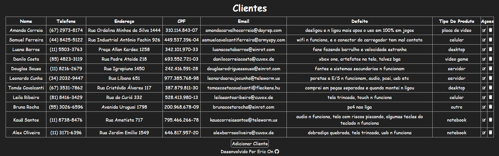

# Projeto Assistencia Tecnica Framework Spring

Este É Um Projeto De Uma Assistência Técnica Fictícia Que Conta Com Uma Página Simples, Um Formulário Para Registro De Solicitações E Uma Tabela De Administração Para Gerenciamento Das Mesmas. Para O Desenvolvimento Do Projeto, Foi Aplicado o Conceito CRUD Utilizando O Framework Spring.

 

Na Imagem Acima, Podemos Observar A Página Inicial Do Site Que Apresenta Diversas Opções de Serviços Disponíveis para os Clientes. Há Um Slider Em Destaque que Exibe Alguns dos Serviços Oferecidos, Além De Cards Com Outras Opções Disponíveis. Para Solicitar um Orçamento, Há Um Formulário Disponível Para Os Clientes Preencherem.

 

Na Imagem Acima Temos A Tabela De Administração Onde O Administrador Pode Ver Todas As Solicitações Feitas Pelos Clientes, Também Pode Editar E Excluir As Solicitações.

